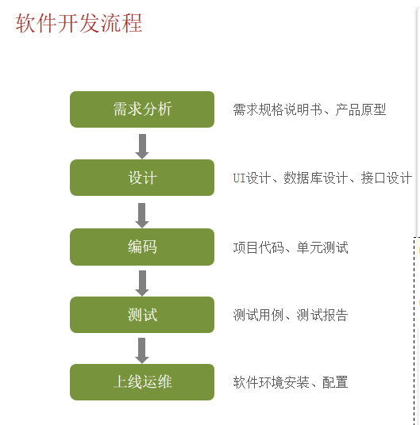
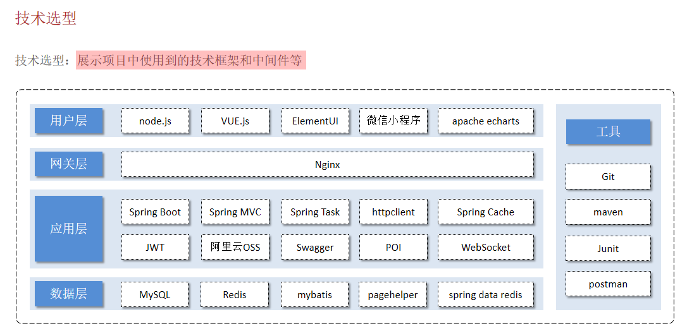
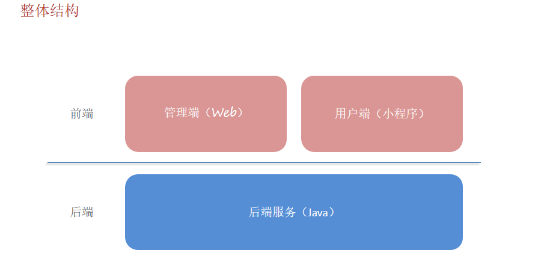

## 1.软件开发基本知识

### （1）软件开发流程



软件开发经历的阶段：

- 需求分析：编写需求规格说明书，设计产品原型
- 设计：包括UI设计，数据库设计，接口设计，技术选型（选择什么技术栈）
- 编码：前端开发人员和后端开发人员共同合作编写代码，实现功能
- 测试：测试人员对各个功能，模块进行测试，确保满足用户需求。（测试和编码是同时进行的，并不是等整个项目的代码都写完再去测试的，没有这么多时间可以浪费，一边测试一边修改）
- 运维：部署项目，运行维护


### （2）软件环境

- 开发环境：开发人员在开发阶段使用的环境
- 测试环境：测试人员使用的环境，用于测试项目
- 生产环境：正式提供对外服务的环境


### （3）技术选型和项目结构





#### 什么是单体项目？

单体项目，就是**整个应用作为一个整体（一个代码库、一个部署单元）来构建和运行**的项目。无论是前端、后端、业务逻辑、数据处理等，所有模块都集成在一个项目中。

> 想象一个“大而全”的应用：所有功能模块都堆在一个项目里，一起启动、一起部署。

苍穹外卖这个项目就是一个单体项目，所有模块都可以在一个项目中实现。开发完成后，整个项目都打成一个 `.jar` 或 `.war` 包，然后部署到服务器上运行。

单体项目的优点：

**简单易上手**：项目结构统一，新手容易理解。

**开发效率高**：团队可以快速开发，不需要处理服务之间的通信问题。

**部署方便**：一个包打完就可以部署，不用管理多个服务。

**测试方便**：集成测试、端到端测试更直接。

单体项目的缺点：

**不易扩展**：功能越来越多后，项目变得臃肿、模块之间耦合严重。

**部署成本高**：修改一点点代码也需要整个项目重新打包部署。

**不适合大团队协作**：多人开发容易出现冲突。

**难以复用**：模块之间依赖紧密，想把某部分独立出来很麻烦。

**高可用性差**：某个模块挂了，可能会影响整个系统。

单体项目适合小中型应用，大型应用的问题明显增多。


#### 什么是前后端分离项目？

**前后端分离**其实和**单体项目**是两个不同的概念，它指的是前端和后端在开发、部署和运行上的**职责分工**和**边界清晰化**。

前后端分离是指：

- **前端**只负责界面展示和用户交互，使用 HTML/CSS/JavaScript。
- **后端**只负责处理业务逻辑、数据库操作、接口返回。
- 前后端通过 HTTP 接口通信，而不是直接嵌套在一个页面里。

------

前后端分离的典型工作流程：

1. 前端项目部署在静态服务器（如 Nginx、Vercel）。
2. 后端部署在应用服务器（如 Tomcat、Node 服务等）。
3. 用户访问网站，浏览器加载前端页面。
4. 页面需要数据时，通过 AJAX 或 fetch 请求后端 API，后端返回 JSON 数据。
5. 前端拿到数据再渲染到页面上。

现在基本都是前后端分离模式进行开发，像很久以前的 JSP 这些老项目就是前后端不分离的，前后端代码耦合在一起。

前后端分离是一种**架构模式**，单体项目是**部署结构**，它们可以共存：

- 单体 + 分离
- 单体 + 不分离


#### 什么是微服务项目？

微服务项目指的是：把一个完整的系统拆分成多个小的、独立部署的服务，每个服务负责一个功能模块，相互之间通过网络通信（通常是 HTTP 或消息队列）协作完成整个系统的业务逻辑。

比如苍穹外卖这个项目，可以拆分成：用户服务，分类服务，菜品服务，订单服务等等，每个服务部署在一个服务器上，拥有独立的数据库、代码库、技术栈。当然，每个服务并不是完全独立的，不同的服务之间可以相互通信，类似于进程间通信，多个不同的进程构成一个完整的系统，一个进程的崩溃有可能会影响其他进程，也有可能不影响。

微服务的优点：

- **高可维护性**：每个服务小巧、聚焦，代码量少、容易修改
- **技术多样性**：不同服务可以用不同语言或框架
- **独立部署**：某个服务更新时，不影响整个系统
- **可扩展性好**：可以只扩容订单服务，而不是整个系统
- **适合大团队**：团队可以分模块工作，互不影响

微服务的缺点：

- **开发复杂度高**：要处理服务之间的通信、鉴权、容错、限流等问题
- **部署更麻烦**：每个服务都要单独部署、监控
- **运维成本高**：涉及服务注册发现、日志追踪、监控告警等
- **测试困难**：多服务协作，集成测试变复杂
- **数据一致性难处理**：各服务有自己的数据库，跨服务事务难搞


#### 什么是分布式项目？

**分布式项目**，是指系统的多个组件部署在**不同的服务器/节点上**，通过网络协同工作，像一个整体一样对外提供服务。

分布式 ≠ 微服务（但微服务通常是分布式）

分布式项目：关注的是**部署结构**和资源分布：多个服务/模块运行在不同机器上

微服务项目：是一种**架构模式**，通过拆分服务实现模块解耦。微服务通常是分布式部署的

可以存在：

- 一个**单体架构**的分布式项目（比如多个实例部署在不同机器做负载均衡）

- 一个**微服务架构**的分布式项目（每个服务在不同节点上）


## 2.Builder Pattern 和 @Builder

Builder Pattern（建造者模式）是一种设计模式，常用于那些复杂对象的创建过程。它将对象的创建和使用分离，允许通过逐步构建对象的各个部分，最后通过 `build()` 方法完成对象的创建。

在 Java 中，链式调用通常是通过每个方法返回当前对象本身来实现的。这样就可以在一个语句中调用多个方法，每个方法执行完后，返回当前对象本身，继续调用下一个方法。`build()` 方法通常用于将配置好的对象从建造过程中返回最终的实例。在建造者模式中，`build()` 是最后的调用，它标志着配置过程的结束，并返回一个构建完成的对象。

`@Builder` 注解与 Builder Pattern（建造者模式）密切相关，它是 Java 中的一种简化 Builder 模式实现的工具，尤其是在使用 Lombok 库时。

在没有使用 Lombok 的情况下，手动实现 Builder 模式：

```java
@SpringBootTest
class SkyApplicationTests {

    @Test
    void test() {
        Person person = new Person.Builder()
                .setName("tom")
                .setAge(18)
                .build();

        System.out.println(person);
    }

}

@Data
@AllArgsConstructor
@NoArgsConstructor
class Person {
    private String name;
    private int age;

    // Builder 是 Person 的静态内部类，所以可以 new Person.Builder() 创建对象
    public static class Builder {
        // Builder 的属性和 外部类保持一致，这样对 Builder 的赋值就可以转变成对外部类的赋值
        private String name;
        private int age;

        // set 方法的返回值还是 Builder 实例，也就是返回自己的引用，这样可以连续调用，连续赋值
        public Builder setName(String name) {
            this.name = name;
            return this;
        }

        public Builder setAge(int age) {
            this.age = age;
            return this;
        }

        // build 方法，返回一个真正的外部类对象，是用 Builder 的属性帮你 new 一个外部类实例出来
        public Person build() {
            return new Person(name, age);
        }
    }

}
```

Lombok + @Builder：

```java
import lombok.Builder;

@Builder
class Person {
    private String name;
    private int age;
}

public class Main {
    public static void main(String[] args) {
        Person person = Person.builder()  // 在Person类中有一个builder()静态方法，调用这个方法返回一个Builder对象
                            .name("John")
                            .age(30)
                            .build();  // build() 方法返回构建好的对象
        
       Person jerry = new Person("jerry", 22); // @Builder自动添加一个全参构造

        System.out.println(person);
    }
}

```

Lombok 会自动为你生成一个 `PersonBuilder` 类，它包括了 `setName`、`setAge` 等方法，最后还会生成一个 `build()` 方法。你可以像使用手动实现的 Builder 一样使用它。

这是Person.class

```java
//
// Source code recreated from a .class file by IntelliJ IDEA
// (powered by FernFlower decompiler)
//

package com.example.sky;

import lombok.Generated;

class Person {
    String name;
    int age;

    // 自动加入一个全参构造
    @Generated
    Person(final String name, final int age) {
        this.name = name;
        this.age = age;
    }

    // 返回一个PersonBuilder对象
    @Generated
    public static PersonBuilder builder() {
        return new PersonBuilder();
    }

    @Generated
    public static class PersonBuilder {
        @Generated
        private String name;
        @Generated
        private int age;

        @Generated
        PersonBuilder() {
        }

        @Generated
        public PersonBuilder name(final String name) {
            this.name = name;
            return this;
        }

        @Generated
        public PersonBuilder age(final int age) {
            this.age = age;
            return this;
        }

        // new一个Person实例并返回
        @Generated
        public Person build() {
            return new Person(this.name, this.age);
        }

        @Generated
        public String toString() {
            return "Person.PersonBuilder(name=" + this.name + ", age=" + this.age + ")";
        }
    }
}
```

注意：

- @Builder 注解会自动生成一个全参构造，所以这个类没有空参构造，建议添加 @Data、@NoArgsConstructor 注解。
- @Builder 是一个注解，它的元注解是：`@Target({ElementType.TYPE, ElementType.METHOD, ElementType.CONSTRUCTOR})`、`@Retention(RetentionPolicy.SOURCE)`，只存在于源码阶段。

在编译阶段，Lombok 的注解处理器会拦截编译过程，对添加了 @Builder 的类进行处理，并加入到编译产物中，也就是在 .class 文件中一样能看到 Builder 类。当然，在编译过程中拦截确实会消耗一些性能。


## 3.BeanUtils ：浅拷贝

在苍穹外卖这个项目中，因为经常要拷贝属性，所以使用了大量的 `BeanUtils.copyProperties` 方法，当时没有觉得有什么不对的。

现在才知道，原来 `BeanUtils.copyProperties` 是浅拷贝。其实 `BeanUtils.copyProperties` 做的事情非常简单，就是 `a.setXxx(b.getXxx)`，只是对这些操作进行了封装罢了。由此能看出，`BeanUtils.copyProperties` 当然是浅拷贝，如果是基本数据类型，就是直接赋值；如果是引用数据类型，就是复制引用。

不过，如果只是复制，没有修改，其实也不会出现问题，但是，如果不仅要拷贝属性，还要修改属性，那么就不适合使用 `BeanUtils.copyPropertie`。

还有一点，`BeanUtils.copyProperties`是通过反射机制进行属性拷贝的，所以性能肯定会比手动的 getter、setter 要差。不过一般也不会考虑这些，偷懒是很正常的。

------

多提一嘴，`BeanUtils`有两种版本，一个是 `springframework`的，一个是`apache`的。

这两个版本的区别是：

- `springframework`的参数是`(source, target)`，`apache`的参数是`(target, source)`
- `springframework`的性能好，`apache`的性能差，虽然都赶不上原始 getter、setter 操作

不过这两种方式都是浅拷贝。


## 4.ThreadLocal

`ThreadLocal` 是 Java 中的一个类，用于创建线程局部变量，也就是说，每个线程访问的都是自己独立的变量副本。它非常适合在多线程环境下，避免共享变量带来的线程安全问题。

ThreadLocal 常用方法：

| 方法名         | 说明                                                         |
| -------------- | ------------------------------------------------------------ |
| `get()`        | 获取当前线程所对应的变量副本。如果没有初始化过，会调用 `initialValue()` 方法 |
| `set(T value)` | 设置当前线程的变量副本值                                     |
| `remove()`     | 移除当前线程的变量副本，防止内存泄漏（建议在线程结束或使用完毕后调用） |

一个 `ThreadLocal` 实例对象只能存储一个线程局部变量，如果该线程内部需要用到多个局部变量，可以创建多个 `ThreadLocal` 实例。

```java
    private static ThreadLocal<Long> id = new ThreadLocal<>();
    private static ThreadLocal<String> name = new ThreadLocal<>();

    public static Long getId() {
        return id.get();
    }

    public static void setId(Long id) {
        BaseContext.id.set(id);
    }

    public static void removeId() {
        id.remove();
    }

    public static String getName() {
        return name.get();
    }

    public static void setName(String username) {
        name.set(username);
    }

    public static void removeName() {
        name.remove();
    }
```

在大多数服务器中，一个请求会从线程池中分配一个线程去执行，这些线程是可以复用的，所以 `ThreadLocal` 的值是跟线程有关的。

但是，当一次请求结束后，线程会被回收，这个线程管理的 `ThreadLocal` 也应该被清理，不然当下一次请求发送到服务器的时候，有可能会使用到上一次的数据残留。

一般来说，在拦截器中的 `afterCompletion` 方法进行手动 remove 即可。