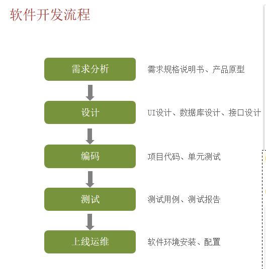
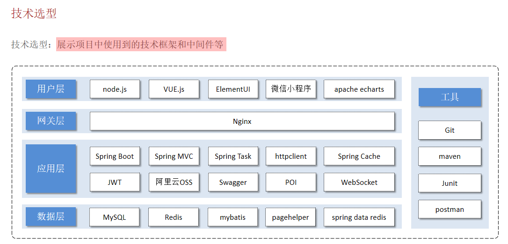
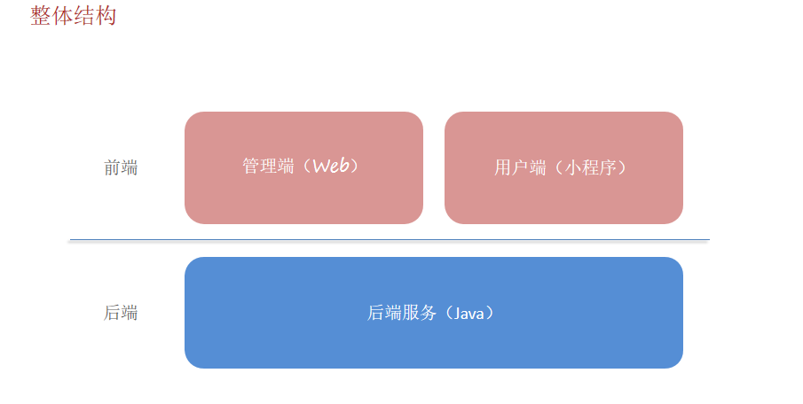

## 1.软件开发基本知识

### （1）软件开发流程



软件开发经历的阶段：

- 需求分析：编写需求规格说明书，设计产品原型
- 设计：包括UI设计，数据库设计，接口设计，技术选型（选择什么技术栈）
- 编码：前端开发人员和后端开发人员共同合作编写代码，实现功能
- 测试：测试人员对各个功能，模块进行测试，确保满足用户需求。（测试和编码是同时进行的，并不是等整个项目的代码都写完再去测试的，没有这么多时间可以浪费，一边测试一边修改）
- 运维：部署项目，运行维护


### （2）软件环境

- 开发环境：开发人员在开发阶段使用的环境
- 测试环境：测试人员使用的环境，用于测试项目
- 生产环境：正式提供对外服务的环境


### （3）技术选型和项目结构





#### 什么是单体项目？

单体项目，就是**整个应用作为一个整体（一个代码库、一个部署单元）来构建和运行**的项目。无论是前端、后端、业务逻辑、数据处理等，所有模块都集成在一个项目中。

> 想象一个“大而全”的应用：所有功能模块都堆在一个项目里，一起启动、一起部署。

苍穹外卖这个项目就是一个单体项目，所有模块都可以在一个项目中实现。开发完成后，整个项目都打成一个 `.jar` 或 `.war` 包，然后部署到服务器上运行。

单体项目的优点：

**简单易上手**：项目结构统一，新手容易理解。

**开发效率高**：团队可以快速开发，不需要处理服务之间的通信问题。

**部署方便**：一个包打完就可以部署，不用管理多个服务。

**测试方便**：集成测试、端到端测试更直接。

单体项目的缺点：

**不易扩展**：功能越来越多后，项目变得臃肿、模块之间耦合严重。

**部署成本高**：修改一点点代码也需要整个项目重新打包部署。

**不适合大团队协作**：多人开发容易出现冲突。

**难以复用**：模块之间依赖紧密，想把某部分独立出来很麻烦。

**高可用性差**：某个模块挂了，可能会影响整个系统。

单体项目适合小中型应用，大型应用的问题明显增多。


#### 什么是前后端分离项目？

**前后端分离**其实和**单体项目**是两个不同的概念，它指的是前端和后端在开发、部署和运行上的**职责分工**和**边界清晰化**。

前后端分离是指：

- **前端**只负责界面展示和用户交互，使用 HTML/CSS/JavaScript。
- **后端**只负责处理业务逻辑、数据库操作、接口返回。
- 前后端通过 HTTP 接口通信，而不是直接嵌套在一个页面里。

------

前后端分离的典型工作流程：

1. 前端项目部署在静态服务器（如 Nginx、Vercel）。
2. 后端部署在应用服务器（如 Tomcat、Node 服务等）。
3. 用户访问网站，浏览器加载前端页面。
4. 页面需要数据时，通过 AJAX 或 fetch 请求后端 API，后端返回 JSON 数据。
5. 前端拿到数据再渲染到页面上。

现在基本都是前后端分离模式进行开发，像很久以前的 JSP 这些老项目就是前后端不分离的，前后端代码耦合在一起。

前后端分离是一种**架构模式**，单体项目是**部署结构**，它们可以共存：

- 单体 + 分离
- 单体 + 不分离


#### 什么是微服务项目？

微服务项目指的是：把一个完整的系统拆分成多个小的、独立部署的服务，每个服务负责一个功能模块，相互之间通过网络通信（通常是 HTTP 或消息队列）协作完成整个系统的业务逻辑。

比如苍穹外卖这个项目，可以拆分成：用户服务，分类服务，菜品服务，订单服务等等，每个服务部署在一个服务器上，拥有独立的数据库、代码库、技术栈。当然，每个服务并不是完全独立的，不同的服务之间可以相互通信，类似于进程间通信，多个不同的进程构成一个完整的系统，一个进程的崩溃有可能会影响其他进程，也有可能不影响。

微服务的优点：

- **高可维护性**：每个服务小巧、聚焦，代码量少、容易修改
- **技术多样性**：不同服务可以用不同语言或框架
- **独立部署**：某个服务更新时，不影响整个系统
- **可扩展性好**：可以只扩容订单服务，而不是整个系统
- **适合大团队**：团队可以分模块工作，互不影响

微服务的缺点：

- **开发复杂度高**：要处理服务之间的通信、鉴权、容错、限流等问题
- **部署更麻烦**：每个服务都要单独部署、监控
- **运维成本高**：涉及服务注册发现、日志追踪、监控告警等
- **测试困难**：多服务协作，集成测试变复杂
- **数据一致性难处理**：各服务有自己的数据库，跨服务事务难搞


#### 什么是分布式项目？

**分布式项目**，是指系统的多个组件部署在**不同的服务器/节点上**，通过网络协同工作，像一个整体一样对外提供服务。

分布式 ≠ 微服务（但微服务通常是分布式）

分布式项目：关注的是**部署结构**和资源分布：多个服务/模块运行在不同机器上

微服务项目：是一种**架构模式**，通过拆分服务实现模块解耦。微服务通常是分布式部署的

可以存在：

- 一个**单体架构**的分布式项目（比如多个实例部署在不同机器做负载均衡）

- 一个**微服务架构**的分布式项目（每个服务在不同节点上）


## 2.Builder Pattern 和 @Builder

Builder Pattern（建造者模式）是一种设计模式，常用于那些复杂对象的创建过程。它将对象的创建和使用分离，允许通过逐步构建对象的各个部分，最后通过 `build()` 方法完成对象的创建。

在 Java 中，链式调用通常是通过每个方法返回当前对象本身来实现的。这样就可以在一个语句中调用多个方法，每个方法执行完后，返回当前对象本身，继续调用下一个方法。`build()` 方法通常用于将配置好的对象从建造过程中返回最终的实例。在建造者模式中，`build()` 是最后的调用，它标志着配置过程的结束，并返回一个构建完成的对象。

`@Builder` 注解与 Builder Pattern（建造者模式）密切相关，它是 Java 中的一种简化 Builder 模式实现的工具，尤其是在使用 Lombok 库时。

在没有使用 Lombok 的情况下，手动实现 Builder 模式：

```java
@SpringBootTest
class SkyApplicationTests {

    @Test
    void test() {
        Person person = new Person.Builder()
                .setName("tom")
                .setAge(18)
                .build();

        System.out.println(person);
    }

}

@Data
@AllArgsConstructor
@NoArgsConstructor
class Person {
    private String name;
    private int age;

    // Builder 是 Person 的静态内部类，所以可以 new Person.Builder() 创建对象
    public static class Builder {
        // Builder 的属性和 外部类保持一致，这样对 Builder 的赋值就可以转变成对外部类的赋值
        private String name;
        private int age;

        // set 方法的返回值还是 Builder 实例，也就是返回自己的引用，这样可以连续调用，连续赋值
        public Builder setName(String name) {
            this.name = name;
            return this;
        }

        public Builder setAge(int age) {
            this.age = age;
            return this;
        }

        // build 方法，返回一个真正的外部类对象，是用 Builder 的属性帮你 new 一个外部类实例出来
        public Person build() {
            return new Person(name, age);
        }
    }

}
```

Lombok + @Builder：

```java
import lombok.Builder;

@Builder
class Person {
    private String name;
    private int age;
}

public class Main {
    public static void main(String[] args) {
        Person person = Person.builder()  // 在Person类中有一个builder()静态方法，调用这个方法返回一个Builder对象
                            .name("John")
                            .age(30)
                            .build();  // build() 方法返回构建好的对象
        
       Person jerry = new Person("jerry", 22); // @Builder自动添加一个全参构造

        System.out.println(person);
    }
}

```

Lombok 会自动为你生成一个 `PersonBuilder` 类，它包括了 `setName`、`setAge` 等方法，最后还会生成一个 `build()` 方法。你可以像使用手动实现的 Builder 一样使用它。

这是Person.class

```java
//
// Source code recreated from a .class file by IntelliJ IDEA
// (powered by FernFlower decompiler)
//

package com.example.sky;

import lombok.Generated;

class Person {
    String name;
    int age;

    // 自动加入一个全参构造
    @Generated
    Person(final String name, final int age) {
        this.name = name;
        this.age = age;
    }

    // 返回一个PersonBuilder对象
    @Generated
    public static PersonBuilder builder() {
        return new PersonBuilder();
    }

    @Generated
    public static class PersonBuilder {
        @Generated
        private String name;
        @Generated
        private int age;

        @Generated
        PersonBuilder() {
        }

        @Generated
        public PersonBuilder name(final String name) {
            this.name = name;
            return this;
        }

        @Generated
        public PersonBuilder age(final int age) {
            this.age = age;
            return this;
        }

        // new一个Person实例并返回
        @Generated
        public Person build() {
            return new Person(this.name, this.age);
        }

        @Generated
        public String toString() {
            return "Person.PersonBuilder(name=" + this.name + ", age=" + this.age + ")";
        }
    }
}
```

注意：

- @Builder 注解会自动生成一个全参构造，所以这个类没有空参构造，建议添加 @Data、@NoArgsConstructor 注解。
- @Builder 是一个注解，它的元注解是：`@Target({ElementType.TYPE, ElementType.METHOD, ElementType.CONSTRUCTOR})`、`@Retention(RetentionPolicy.SOURCE)`，只存在于源码阶段。

在编译阶段，Lombok 的注解处理器会拦截编译过程，对添加了 @Builder 的类进行处理，并加入到编译产物中，也就是在 .class 文件中一样能看到 Builder 类。当然，在编译过程中拦截确实会消耗一些性能。


## 3.BeanUtils ：浅拷贝

在苍穹外卖这个项目中，因为经常要拷贝属性，所以使用了大量的 `BeanUtils.copyProperties` 方法，当时没有觉得有什么不对的。

现在才知道，原来 `BeanUtils.copyProperties` 是浅拷贝。其实 `BeanUtils.copyProperties` 做的事情非常简单，就是 `a.setXxx(b.getXxx)`，只是对这些操作进行了封装罢了。由此能看出，`BeanUtils.copyProperties` 当然是浅拷贝，如果是基本数据类型，就是直接赋值；如果是引用数据类型，就是复制引用。

不过，如果只是复制，没有修改，其实也不会出现问题，但是，如果不仅要拷贝属性，还要修改属性，那么就不适合使用 `BeanUtils.copyPropertie`。

还有一点，`BeanUtils.copyProperties`是通过反射机制进行属性拷贝的，所以性能肯定会比手动的 getter、setter 要差。不过一般也不会考虑这些，偷懒是很正常的。

------

多提一嘴，`BeanUtils`有两种版本，一个是 `springframework`的，一个是`apache`的。

这两个版本的区别是：

- `springframework`的参数是`(source, target)`，`apache`的参数是`(target, source)`
- `springframework`的性能好，`apache`的性能差，虽然都赶不上原始 getter、setter 操作

不过这两种方式都是浅拷贝。


## 4.ThreadLocal

`ThreadLocal` 是 Java 中的一个类，用于创建线程局部变量，也就是说，每个线程访问的都是自己独立的变量副本。它非常适合在多线程环境下，避免共享变量带来的线程安全问题。

ThreadLocal 常用方法：

| 方法名         | 说明                                                         |
| -------------- | ------------------------------------------------------------ |
| `get()`        | 获取当前线程所对应的变量副本。如果没有初始化过，会调用 `initialValue()` 方法 |
| `set(T value)` | 设置当前线程的变量副本值                                     |
| `remove()`     | 移除当前线程的变量副本，防止内存泄漏（建议在线程结束或使用完毕后调用） |

一个 `ThreadLocal` 实例对象只能存储一个线程局部变量，如果该线程内部需要用到多个局部变量，可以创建多个 `ThreadLocal` 实例。

```java
    private static ThreadLocal<Long> id = new ThreadLocal<>();
    private static ThreadLocal<String> name = new ThreadLocal<>();

    public static Long getId() {
        return id.get();
    }

    public static void setId(Long id) {
        BaseContext.id.set(id);
    }

    public static void removeId() {
        id.remove();
    }

    public static String getName() {
        return name.get();
    }

    public static void setName(String username) {
        name.set(username);
    }

    public static void removeName() {
        name.remove();
    }
```

在大多数服务器中，一个请求会从线程池中分配一个线程去执行，这些线程是可以复用的，所以 `ThreadLocal` 的值是跟线程有关的。

但是，当一次请求结束后，线程会被回收，这个线程管理的 `ThreadLocal` 也应该被清理，不然当下一次请求发送到服务器的时候，有可能会使用到上一次的数据残留。

一般来说，在拦截器中的 `afterCompletion` 方法进行手动 remove 即可。


## 5. Http 请求类型

Http 请求的常见类型有：

**GET**

GET 请求用于请求资源，请求参数通过查询参数(`URL?key=value`) 或者 路径参数(`URL/1`) 传递给后端。

GET 请求具有**幂等性**：多次请求相同的 GET 方法不会更改数据，结果相同。因为 get 方法是用来请求资源的，不会对服务器数据进行修改。

GET 请求不能使用 body，因为在 HTTP 规范（RFC 7231）指出：GET 请求的 body 没有标准意义，服务器不应该解析它。

所以，很多服务器都会直接忽视 GET 请求的 body，不会解析它，即使使用了 body 也不会被处理。

**POST**

POST 请求用于创建新的资源，会对服务器数据进行修改。请求参数通常放在 body 中，使用 JSON 格式。

POST 请求不具备**幂等性**：多次发送相同 POST 请求可能会创建多个相同资源。

POST 请求可以使用查询参数和路径参数，并不是只能使用 body，但是，如果是重要的数据，还是要放在 body 中传送过去。

**PUT**

PUT 请求更新资源，需要发送完整的资源数据，即全部更新。

PUT 请求具备**幂等性**：相同的 PUT 请求多次执行，结果不会变化。

POST 请求可以使用 body、查询参数、路径参数。

**DELETE**

DELETE 请求用于删除资源，通常不需要 body。

DELETE 请求具有**幂等性**：多次执行相同 DELETE 请求，结果相同（删除后再删除会返回 404）。

- GET 请求具有幂等性
- POST 请求不具有幂等性
- PUT 请求应该具有幂等性
- DELETE 请求具有幂等性


## 6.小程序登录

Http 接口：

GET https://api.weixin.qq.com/sns/jscode2session 

**请求参数**

| 属性       | 类型   | 必填 | 说明                                                         |
| :--------- | :----- | :--- | :----------------------------------------------------------- |
| appid      | string | 是   | 小程序 appId                                                 |
| secret     | string | 是   | 小程序 appSecret                                             |
| js_code    | string | 是   | 登录时获取的 code，可通过[wx.login](https://developers.weixin.qq.com/miniprogram/dev/api/open-api/login/wx.login.html)获取 |
| grant_type | string | 是   | 授权类型，此处只需填写 authorization_code                    |

**返回参数**

| session_key | string | 会话密钥                   |
| ----------- | ------ | -------------------------- |
| unionid     | string | 用户在开放平台的唯一标识符 |
| errmsg      | string | 错误信息，请求失败时返回   |
| openid      | string | 用户唯一标识               |
| errcode     | int32  | 错误码，请求失败时返回     |

**错误码**

| 错误码 | 错误描述                                                  | 解决方案                          |
| :----- | :-------------------------------------------------------- | :-------------------------------- |
| 40029  | code 无效                                                 | js_code无效                       |
| 45011  | api minute-quota reach limit mustslower retry next minute | API 调用太频繁，请稍候再试        |
| 40226  | code blocked                                              | 高风险等级用户，小程序登录拦截 。 |
| -1     | system error                                              | 系统繁忙，此时请开发者稍候再试    |

openid 是微信开放平台中每一个网站或者APP独有的，而 unionid 是整个微信开放平台共享的，一个用户在不同的平台上可以有多个 openid，但只能有一个 unionid。


## 7.HttpClient

使用 HttpClient 只需要关心三件事情，怎么携带 Body，怎么携带请求参数，怎么携带路径参数？

Http 请求归根到底就是发送请求给后端，在请求中携带数据，所以只需要关心携带数据的方式即可，请求类型的区别不过就是将 HttpGet 换成 HttpPost、HttpPut 而已。

**最简单的 GET 请求，不携带任何数据**

```java
    @Test
    void test() {
        // 1.获取HttpClient实例
        CloseableHttpClient httpclient = HttpClients.createDefault();

        // 2.如果是GET请求，就创建HttpGet实例，然后HttpClient实例调用execute方法发送请求，其他请求以此类推
        HttpGet httpGet = new HttpGet("http://localhost:8080/admin/employee/test"); // 指定请求的url

        CloseableHttpResponse httpResponse = null;
        // 3.发送请求
        try {
            // 4.获取后端响应
            httpResponse = httpclient.execute(httpGet);

            // 获取Body
            HttpEntity entity = httpResponse.getEntity();
            String json = EntityUtils.toString(entity); 
            Result result = JSON.parseObject(json, Result.class);
            System.out.println(result);
            // 获取Header
            Header[] allHeaders = httpResponse.getAllHeaders(); // getAllHeaders 和 getHeaders
            System.out.println(Arrays.toString(allHeaders));
            Header[] headers = httpResponse.getHeaders("Content-Type");
            System.out.println(Arrays.toString(headers));
            // 获取状态码
            int statusCode = httpResponse.getStatusLine().getStatusCode();
            System.out.println(statusCode);

        } catch (IOException e) {
            throw new RuntimeException(e);
        } finally {
            // 5.关闭资源
            try {
                httpResponse.close();
                httpclient.close();
            } catch (IOException e) {
                throw new RuntimeException(e);
            }
        }
    }
```

使用 HttpClient 发送请求的五部曲：

1. 获取 HttpClient 实例
2. 创建对应的 Http 请求实例
3. 发送请求（这里不讨论携带数据的问题）
4. 获取返回结果并处理
5. 断开连接，HttpClient 实例和 HttpResponse 实例都需要调用 close 方法关闭资源。类名都已经叫 Closeable 了。

Questions：

- 为什么需要将 HttpEntity 转成字符串，在用 JSON 转成 JavaBean 实例对象？
  - 因为 HttpEntity 是 Apache 封装好的对象，根本没有提供直接转成 JavaBean 对象的 API，但是提供了 EntityUtils 工具类。
-  getAllHeaders 和 getHeaders 有什么区别？
  - 类似于反射里面的 getFileds 和 getFiled；getConstructors 和 getgetConstructor；获取一个和获取多个的区别。
- getHeaders 为什么返回的是一个 Header 数组？
  - 因为 Http 协议中允许多个同名的 Header，所以调用 getHeaders 传入的是一个 String 对象，但是可能存在多个对应的 Header 实例。
  - 每个 Header 对象包含两个字段：name 和 value。所以返回的是一个数组，不是 Map，因为 Map 的 key 不能重复。
- 为什么获取状态码是通过 getStatusLine().getStatusCode() 获取，不是先获取 Header，再获取状态码？
  - 其实，在 Http 协议中，状态码是位于第一行的，下面才是 Header 和 Body，不是严格意义上的 header field。
  - 可以简单将 HttpResponse 看成 3 层结构，Header、Body、StatusCode，访问不同的数据有不同的方法。

**携带Body**

```java
        // 指定url
        HttpPost httpPost = new HttpPost("http://localhost:8080/admin/employee/test2");
        // 指定Content-Type
        httpPost.setHeader("Content-Type", "application/json");
        // 获得JSON格式数据
        Student student = new Student("aaa", 17);
        String json = JSON.toJSONString(student);
        // 获得JSON格式数据没有，必须将JSON格式变成Entity实例
        StringEntity entity = new StringEntity(json, ContentType.APPLICATION_JSON);

        httpPost.setEntity(entity);
```

**携带请求参数**

方法不唯一，只要将数据拼在路径上就行，还可以用 StringBuilder 

```java
        // 携带请求参数，直接拼接在路径上即可
        URIBuilder uriBuilder = new URIBuilder("http://localhost:8080/admin/employee/test1");
        URI uri = uriBuilder.setParameter("name", "aaa")
                .setParameter("age", "17") // Spring框架会自动进行类型转换
                .build();
        HttpGet httpGet = new HttpGet(uri);
```

**携带路径参数**

```java
        // 路径参数只能手动拼接
        int number = 1;
        String url = "http://localhost:8080/admin/employee/test3/" + number;
        HttpPut httpPut = new HttpPut(url);
```


## 8.WebSocket

**1.导入坐标**

```XML
        <dependency>
            <groupId>org.springframework.boot</groupId>
            <artifactId>spring-boot-starter-websocket</artifactId>
        </dependency>
```

**2.配置类**

```java
@Configuration
public class WSConfig {
    @Bean
    public ServerEndpointExporter serverEndpointExporter() {
        return new ServerEndpointExporter();
    }
}
```

`ServerEndpointExporter` 是 Spring Boot + WebSocket 整合的关键组件。

它会自动扫描被 `@ServerEndpoint` 注解修饰的类（这些类就是 WebSocket 的端点），然后注册它们到 WebSocket 容器中，使其生效。

注意，是"注册到 WebSocket 容器"，不是注册到 IOC 容器。IOC 容器是 Spring Boot 用来管理 Bean 对象的，而添加了 @ServerEndpoint 注解的类是注册到 WebSocket 容器中。

`ServerEndpointExporter` 只能在 **Spring Boot 使用内嵌容器** 的环境下使用。

如果你使用的是 **外部 Tomcat**，不要注入它，否则会因为 WebSocket 冲突而启动失败

**3.服务端**

```java
@Component
@ServerEndpoint("/ws/{cid}")
@Slf4j
public class WebSocketServer {

    // 保存会话
    private static Map<String, Session> group = new HashMap<>();

    // 建立连接时触发
    @OnOpen
    public void onOpen(@PathParam("cid") String cid, Session session) {
        log.info("用户：{}，建立连接", cid);
        group.put(cid, session);
    }

    // 断开连接时触发
    @OnClose
    public void onClose(@PathParam("cid") String cid) {
        log.info("用户：{}，断开连接", cid);
        group.remove(cid);
    }

    // 客户端发送消息时触发
    @OnMessage
    public void onMessage(@PathParam("cid") String cid, String message) {
        log.info("用户：{}，发送消息：{}", cid, message);
    }

    // 群发
    public void sentAll(String message) {
        Collection<Session> sessions = group.values();
        for (Session session : sessions) {
            try {
                session.getBasicRemote().sendText(message);
            } catch (IOException e) {
                throw new RuntimeException(e);
            }
        }
    }
}
```

比如这个类，添加了 @ServerEndpoint 注解，则会被注册到 WebSocket 容器中。该类表示一个端点，或者说是接口，当客户端发送请求访问这个端点时就可以建立连接。

比如客户端访问了 ws://localhost:8089/ws/199976，那么 cid 就是 199976，客户端和服务端就可以建立连接。

Question：

- WebSocket 协议可以发送什么内容？

  - 主要有两种，一种是文本，也就是 String 字符串；还有一种是字节数据。

- 那这么说，http 不也是这两种吗，JSON 数据还有视频、图片等字节流数据啊，这个跟 http 有什么区别吗？

  - 从发送的数据内容来看，两者确实没什么区别，而且如果按照这种说法，其实很多协议发送的数据类型都差不多。关键的区别是怎么传，什么时候传？
  - Http 协议是单向的，只能不断请求-响应，服务器不能主动发送消息到客户端，每次请求都要携带 Header。而且需要建立 TCP 连接，TCP 的性能是比较差的，不过优点是安全可靠。
  - WebSocket 协议只需要一次握手就可以建立长连接，可以双向通信，发送消息没有额外开销，实时性高。

- onOpen 的 Session session 是哪里来的？

  - Session 是 Java WebSocket API（JSR-356）里的标准接口，是专门为 WebSocket 设计的会话对象，用于代表当前这条 WebSocket 连接。

  - 当客户端通过 WebSocket 发起连接请求时，WebSocket 容器会自动将一个 Session 对象注入 @OnOpen 方法参数中。类似于Session session = new Session();
    onOpen("123", session);

  - Session 常用方法：

  - | 方法                        | 功能说明                               |
    | --------------------------- | -------------------------------------- |
    | session.getId()             | 获取连接 ID                            |
    | session.getUserProperties() | 获取用户属性 Map，可存储自定义数据     |
    | session.getBasicRemote()    | 获取远程通信对象，用于发送消息（同步） |
    | session.getAsyncRemote()    | 异步发送消息                           |
    | session.isOpen()            | 判断连接是否还有效                     |
    | session.close()             | 主动关闭连接                           |

- getBasicRemote 和 getAsyncRemote 有什么区别？

  - getBasicRemote() 返回的是 RemoteEndpoint.Basic 类型实例，同步发送，当前线程会阻塞，直到消息实际发出去或失败。
  - getAsyncRemote() 返回的是 RemoteEndpoint.Async 类型实例，异步发送，消息由 WebSocket 容器的线程池异步发送。


## 9.Spring Task

Spring Task 是 Spring 框架提供的一个任务调度模块，用于在 Java 应用中**定时执行任务**或**异步执行任务**。

如果使用的是**Spring Boot**，则可以直接使用，spring-boot-starter 已经包含了这部分内容。

#### （1）cron表达式

Spring Task 只需要关注两点：执行时间、执行逻辑。执行时间需要通过 cron 表达式指定，执行逻辑需要开发人员自己设计。

一个 cron 表达式是一个由 6 或 7 个字段组成的字符串，用于表示时间调度。

| 字段位置  | 字段名 | 允许值          | 说明                     |
| --------- | ------ | --------------- | ------------------------ |
| 1         | 秒     | 0–59            |                          |
| 2         | 分     | 0–59            |                          |
| 3         | 时     | 0–23            |                          |
| 4         | 日     | 1–31            | 不可与“星期”同时使用 `*` |
| 5         | 月     | 1–12 或 JAN–DEC |                          |
| 6         | 星期   | 1–7 或 SUN–SAT  | 1=星期日                 |
| 7（可选） | 年     | 1970–2099       | 可省略                   |

通配符：

- *：全通配符，表示通配所有
- ,：表示不连续的部分
- -：表示连续的部分
- /：表示间隔多少。*/5：每5个单位执行一次；2/5：从2开始，每5个单位执行一次
- L：最后一个单位。一个月的最后一天，一个月的最后一周，一年的最后一个月：L
- W：最近的一个工作日。距离7号最近的工作日：7W
- #：第几周的周几。每个月第一周的周六：1#6
- ?：不需要。日、月、周、年支持该通配符。日和周必须有一个是?

每月最后一个工作日：LW

每月第1和第3周的周一三五，每5分钟执行：*/5 * * 1-7,15-21 * 1,3,5

#### （2）fixedRate：固定速率

定义的是下一次开始和上一次开始之间的距离，当本次任务开始执行时下一次任务的时间就已经确定了：


如果执行耗时太长，cover 了下一次任务，一旦本次任务结束，下一次立即执行：


#### （3）fixedDelay：固定延迟

定义的是下一次开始和上一次结束之间的距离：


#### （4）入门案例

1.引入依赖

2.开启定时功能

在配置类上加上`@EnableScheduling`注解。

```java
@MapperScan("com.example.mysky.mapper")
@SpringBootApplication
@EnableScheduling
public class MyskyApplication {

    public static void main(String[] args) {
        SpringApplication.run(MyskyApplication.class, args);
    }

}
```


 `@EnableScheduling` 是用来开启 Spring 的定时任务调度功能的。加在配置类上，是为了让 Spring 在启动时就开启调度器（scheduler），配置类（通常是加了 `@Configuration` 的类）是用来注册和初始化框架功能的地方。当然，也可以直接加载主类上，因为主类本身就是一个配置类。

3.编写定时任务

```java
@Component
@Slf4j
public class MyTask {

    @Scheduled(cron = "*/5 * * * * *")
    public void testCron(){
        System.out.println(1);
    }
}
```

`@Component`声明是一个 `Bean` 对象，交给 Spring IOC 管理。

`@Scheduled`声明这是一个定时方法，`@Scheduled`可以使用 cron，也可以使用 fixedRate 和 fixedDelay。注意：这三个属性是互斥的，只能使用其中一个。

#### （5）默认单线程

默认情况下，Spring 的 `@Scheduled` 任务是单线程执行的。

Spring 使用的是一个单线程的调度器（`ScheduledTaskRegistrar` 中默认的 `ScheduledExecutorService`），所以：

- 所有使用 `@Scheduled` 注解的方法会在**同一个线程中串行执行**。
- 如果某个任务执行时间很长，会**阻塞**其他任务的执行（即使你设定了频率或 Cron）。

```java
@Component
@Slf4j
public class MyTask {

    @Scheduled(fixedRate = 5000)
    public void test1() {
        System.out.println(1);

    }

    @Scheduled(cron = "*/5 * * * * *")
    public void test2() throws InterruptedException {
        System.out.println(2);
        Thread.sleep(15000);
    }
    
}
```

test2 方法会阻塞 test1 方法的执行。

------

**开启异步任务**

```java
@Configuration // 声明配置类
public class AppConfig {
    @Bean // 返回值是 Bean 对象，Bean 的名字就是 taskScheduler
    public TaskScheduler taskScheduler() {
        ThreadPoolTaskScheduler scheduler = new ThreadPoolTaskScheduler();
        scheduler.setPoolSize(4);
        scheduler.setThreadNamePrefix("my-task-");
        scheduler.initialize();
        return scheduler;
    }
}
```

这个配置类会返回一个 Bean 对象，Spring 会使用这个 Bean 对象作为调度器，此时可以进行异步任务。

注意：Spring 使用 `TaskScheduler` 类型的 Bean 来调度定时任务。默认情况下，它会查找名为 taskScheduler 的 Bean，如果改了名字可能不会被 Spring 扫描到。

然后在 task 类中正常使用 `@Scheduled`注解即可。


## 10.项目存在的问题：

- 最重要的问题是项目文件的管理，因为该项目涉及多个文件，以及多个方法。
  - 首当其冲的问题就是命名问题，文件名，方法名，变量名都很容易冲突，而且命名有可能不够"见名知义"。看起来这个似乎是小问题，不过其实在真实的实现过程中经常会因此犯错。
  - 还有就是对整个项目的了解不够，在一开始的时候其实思路是比较活跃的，但是一旦整个项目的规模越来越大，就很容易遗忘之前写过的方法，导致同一个功能但是写了多个方法。
  - 最麻烦的一点是项目的耦合度，在整个规模逐渐增加的时候，我就感觉到了，只要改变一点点，有可能就要修改很多地方，甚至有一些以前测试过可以跑的地方都要重新编写。

- 删除套餐的思路不明确。
  - 按理来说，其实套餐是可以正常删除的，因为套餐是由菜品组成的，只是删除套餐，没有删除菜品。但是直接删除套餐会导致数据不一致。
  - 比如用户订了一个A套餐，然后管理端反手就删了这个套餐，那么用户和员工怎么查看这个订单的菜品呢？
  - 其实如果只是上面的情况，可以判断在所有派送中状态前面的订单中查找是否有用户购买该套餐，如果购买了就无法删除。
  - 但是还有一种情况，用户一个月之前购买了A套餐，然后通过历史订单查看自己的购买记录时，如果这个套餐被删除了，根本获取不了这个订单的菜品。
  - 我觉得比较好的方式是：在套餐表中增加一个 deleted 字段，用来判断是否被删除，执行删除操作时只需要设置成 true 就可以了，这样即使套餐被删除了，但是记录还在，还可以获取该套餐的数据。
- 同样的问题出现在删除菜品身上，会面临删除套餐一样的问题
  - 其实还是搞一个 deleted 字段比较好，把物理删除变成逻辑删除。
  - 但是菜品的停售，起售；套餐的停售，起售问题倒是不大，毕竟没有删除数据。而且一般也不会在营业期间对出售的物品进行这些修改操作。
- 管理端的取消订单也很迷
  - 管理端当然可以取消订单。但是我发现在对订单的操作有：完成（接单，拒单等等），取消，查看。点击 "完成" 之后，还会有 "取消" 操作，我就不是很理解，一个订单都已经完成了，怎么还能取消，要取消也是在派送之前取消啊。
- 订单的送达时间字段没有赋值
  - 这个项目主要有管理端和用户端，但是对于具体的配送端没有任何描述，所以导致具体的送达时间无法赋值。
- 管理端取消订单功能未实现
- 管理端 POI 生成 execl 表格功能未实现，也就是数据导出功能没有实现
- SpringCache 框架未学习，因为这个项目的缓存其实比较简单，我是直接用 redis 实现的，没有使用 SpringCache 框架。